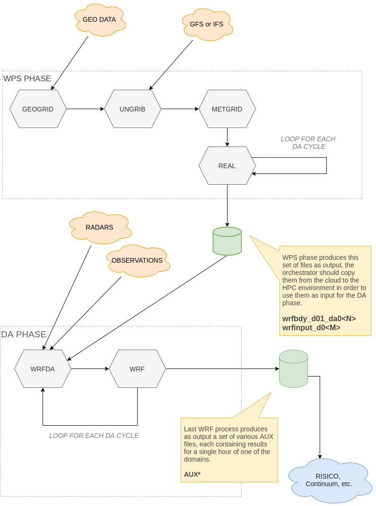

# WRF-DA runner

This repository contain GO source code of wrfda-runner command, which allows
to run a WRF simulation using either a GFS or IFS forecast as guiding conditions,
assimilating radars and weather forecast observations.


## Work environment preparation.

The command must run in a work directory containing a `wrfda-runner.cfg` config file. 
This file should be in a toml format, and allows to customize the path of all others 
external files and directories needed by the process.

The `wrfda-runner.cfg` files contains following mandatory variables:

* __GeodataDir__	-	path to a directory containing static geographic data.
* __CovarMatrixesDir__-	path to a directory containing background errors of covariance matrices.
* __WPSPrg__-	path to compiled binaries of the WPS program.
* __WRFDAPrg__-	path to compiled binaries of the WRF-DA program.
* __WRFMainRunPrg__-	path to compiled binaries of the WRF program, compiled with a custom variables Registry suitable to produce the final output of the simulation.
* __WRFAssStepPrg__-	path to compiled binaries of the WRF program.
* __GFSArchive__-	path to guiding initial and boundary conditions (the variable is used for both GFS and IFS datasets)
* __ObservationsArchive__ - directory containing radars and weather stations datasets to assimilate.
* __NamelistsDir__		- directory of namelists templates used to generates namelists for the configuration of the various processes.


## Command syntax

Run the command without arguments to show syntax:

```bash
$ wrfda-run 
Usage: wrfda-run [-p WPS|DA|WPSDA] [-i GFS|IFS] <workdir> <startdate> <enddate>
format for dates: YYYYMMDDHH
default for -p is WPSDA
default for -i is GFS
```

### Arguments

#### Phase option `-p`

Allows the user to specify which phase o phases to execute. See [#WRFDA-runner-phases](WRFDA runner phases).
The option can assume following values:

* __WPS__	-	only execute the WPS phase. Save results in `<workdir>/inputs`	(this position is not actually configurable)
* __DA__	-	only execute the DA phase. Read as inputs the output files of WPS phase from `<workdir>/inputs`.
* __WPSDA__	-	serially execute both WPS and DA phases, using output of WPS phase as input for the other.


>
> _If this option is not specified, it defaults to "WPSDA" _
> 


#### Input option `-i`

This option allows the user to specify if he want to use a GFS or IFS dataset for boundaries and initial conditions.
GFS datasets normally consists of a file for each hour of forecasts, containing all forecasted variable data.
IFS consists instead of two files, one containing 3D variables data for all hours, the other containing 4D variables.
The command anyway try to import all files contained in the directory specified.

> 
> _If this option is not specified, it defaults to "GFS"_
> 


##### Workdir argument

Path of the directory containing `wrfda-runner.cfg` config file. 
This directory will be used as starting work directory for the command while running the simulations.

At the end of the simulation, the directory will contains a subdirectory for each date of simulation
ran, each one directory containing the complete three of intermediates data and log files used.
These directory are named using a YYYYMMDD format; the command will fail if one of this directories already exists.

Moreover, an inputs directory will be created containing a subdirectories for each date ran containing 
WPS results files and/or DA results files.


##### Startdate argument

##### Enddate argument


## WRFDA runner phases

The `phase` argument allows the user to perform the WRFDA simulation as a whole, or to split it in two different phase: WPS and DA. 
In the LEXIS environment, this allow us to run the WPS pre-processing phase in the CLOUD, and the DA phase afterwards, in an HPC cluster.
When running the simulation as a whole is preferred, the command allow to execute he two phases serially.


### Processes organization within the WPS and DA phases.	

This diagram represent which processes run in the two phases.

	